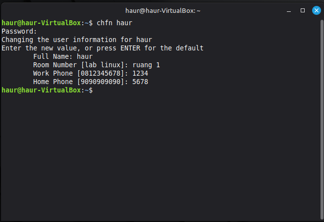
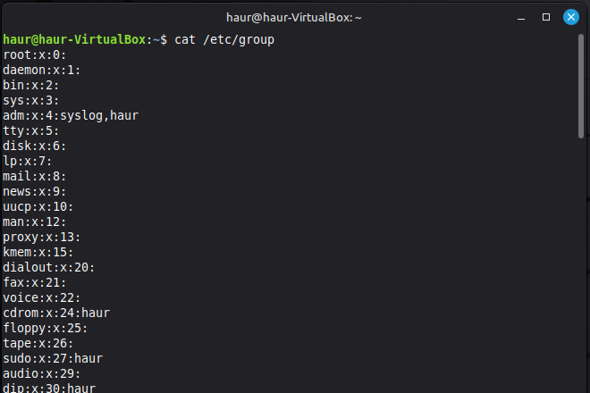

# praktikum-4
# 1.Tugas percobaan 1 informasi finger 
ubahlah informasi finger pada komputer anda

# 2.Tugas percobaan 2 log user aktif
lihatlah user user yang sedang aktif pada komputer anda

# 3.Tugas percobaan 3 group  
buka file $cat /etc/group kemudian analisa root:x:o

Analisa root:x:0  
Berdasarkan hasil eksekusi perintah cat /etc/group, terdapat baris root:x:0 Yang memili format pemisah tanda titik dua (:).  
•	root: Adalah nama grup.Ini merupakan grup administrator dengan hak akses tertinggi.  
•	x : Adalah tempat password grup.karakter (x) ini menandakan letak password yang disembunyikan.  
